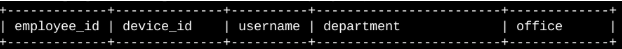
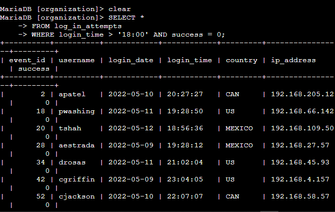
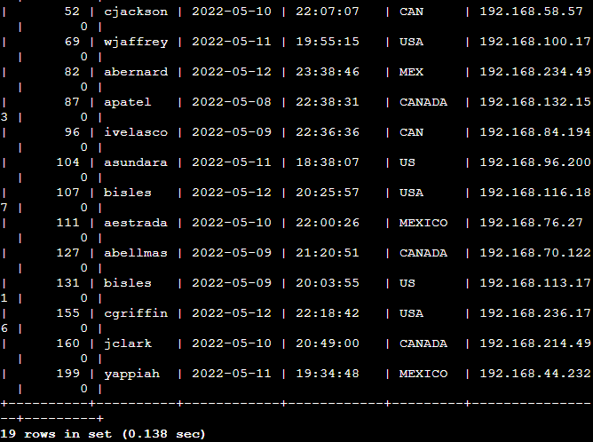
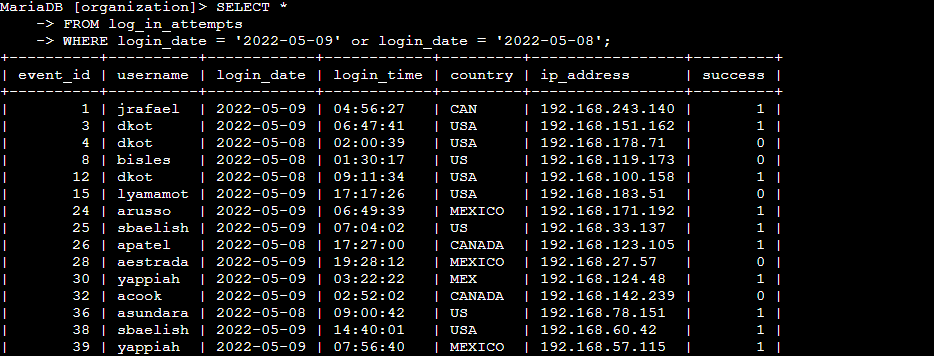
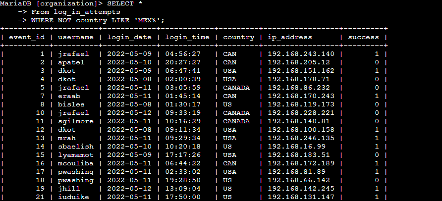
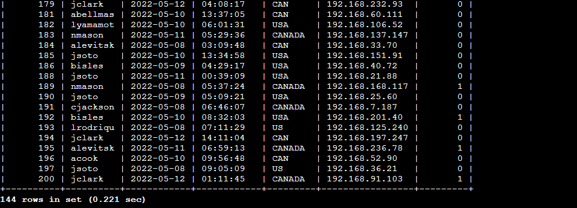

# SQL Practice — Portfolio

This project demonstrates how SQL can be applied to investigate user authentication activity and employee data within a company’s database. Using query filters, I retrieved after-hours login attempts, logins on specific dates, and access attempts from unusual locations. In addition, I practiced retrieving employee information by department to simulate real-world HR and auditing use cases. These exercises highlight SQL’s role in security monitoring and business operations.
All sensitive/personal data has been replaced with placeholders.

## Scenario
I am a security professional at a large organization. Part of my job is to investigate security issues to help keep the system secure. I recently discovered some potential security issues that involve login attempts and employee machines.

My task is to examine the organization’s data in their employees and log_in_attempts tables. Here, I'm using SQL filters to retrieve records from different datasets and investigate the potential security issues.

## Organization database table format

The organization database contains the following two tables:

- <mark>log_in_attempts</mark>
- <mark>employees</mark>

### log_in_attempts
The log_in_attempts table has the following columns:

- <mark>event_id</mark>: The identification number assigned to each login event
- <mark>username</mark>: The username of the employee
- <mark>login_date</mark>: The date the login attempt was recorded
- <mark>login_time</mark>: The time the login attempt was recorded
- <mark>country</mark>: The country where the login attempt occurred
- <mark>ip_address</mark>: The IP address of that employee’s machine
- <mark>success</mark>: The success of the login attempt; FALSE indicates a failed attempt

 
In the MariaDB shell, these columns are returned as:


### employees
The employees table has the following columns:
- <mark>employee_id</mark>: The identification number assigned to each employee
- <mark>device_id</mark>: The identification number assigned to each device used by the employee
- <mark>username</mark>: The username of the employee
- <mark>department</mark>: The department the employee is in
- <mark>office</mark>: The office the employee is located in
  
In the MariaDB shell, these columns are returned as:




## 🗄️ Practice Highlights

### 1. Retrive After Hours login attempts
- **Goal:** My team is investigating failed login attempts that were made after business hours. I want to retrieve this information from the login activity. Office hours end at '18:00'.
    
- **Why it matters:** All the login attemps are stored in the databse. By filtering the failed login attempts made after <mark>'18:00'</mark> I can identify potential threats like Brute-force attacks, compromised accounts, credential stuffing and misconfigurations. It is a part of my daily SOC monitoring.

- **The SQL Query:** ```SELECT *
FROM log_in_attempts
WHERE login_time > '18:00' AND success = FALSE;```

  
- **How this works:** The <mark>login_time</mark> column in the <mark>log_in_attempts</mark> table contains information on when login attempts were made.
The <mark>success</mark> column in the <mark>log_in_attempts</mark> table contains values of <mark>TRUE</mark> or <mark>FALSE</mark> to indicate whether the login was successful. MySQL stores Boolean values as 1 for <mark>TRUE</mark>, and 0 for <mark>FALSE</mark>. This means that <mark>TRUE</mark> is represented as 1, and <mark>FALSE</mark> represented as 0 in the <mark>success</mark> column. In the shell screenshot I can see that 19 failed login attempts were made after '18:00' which means someone is trying to infiltrate the database.

**In MariaDB Shell**  





### 2. Retrive login attempts on a specific date
- **Goal:** Your team is investigating a suspicious event that occurred on '2022-05-09'. I want to retrieve all login attempts that occurred on this day and the day before ('2022-05-08').
    
- **Why it matters:** By filtering the login attempts by date I can narrow down the list and cause of the suspicious event.

- **The SQL Query:** ```SELECT * 
FROM log_in_attempts 
WHERE login_date = '2022-05-09' OR login_date = '2022-05-08';```
  
- **How this works:** The <mark>login_date</mark> column in the <mark>log_in_attempts</mark> table contains information on the dates when login attempts were made. So, if I put '2022-05-09' and '2022-05-08' dates in the <mark>login_date</mark> using OR operator, I should get all the login attempts made in these 2 days. In this case which is 75 attempts in total. Its long so I've put the screenshot of the first few here. 

**In MariaDB Shell**




### 3. Retrive login attempts outside of a place (Mexico)
- **Goal:** There’s been suspicious activity with login attempts, but the team has determined that this activity didn't originate in Mexico. Now, I need to investigate login attempts that occurred outside of Mexico. I'll be using filters in SQL to create a query that identifies all login attempts that occurred outside of Mexico.
    
- **Why it matters:** As the team decided that the login attempts are from outside of Mexico. I should focus on narrowing down the list to the countries that are not Mexico. It saves my team time to investigate the situation.

- **The SQL Query:** ```SELECT * 
FROM log_in_attempts 
WHERE NOT country LIKE 'MEX%';```
  
- **How this works:** The <mark>country</mark> column in the <mark>log_in_attempts</mark> table contains information on the location of the login attempts. As I have to look for countries that are not mexico. I'm gonna use the <mark>NOT</mark> operator after <mark>WHERE</mark>. When referring to Mexico, the country column contains values of both <mark>MEX</mark> and <mark>MEXICO</mark>, and I need to use the <mark>LIKE</mark> keyword with <mark>%</mark> to make sure my query reflects this. Which is why I have used 'MEX%' after <mark>LIKE</mark> keyword to find the countries, I should get all the login attempts made outside of Mexico. In this case which is 144 attempts were made outside of Mexico. Its long list so I've put the screenshot of the first and last few here.

**In MariaDB Shell**





### 4. Retrive employees in Marketing
- **Goal:** My team wants to perform security updates on specific employee machines in the Marketing department. I am responsible for getting information on these employee machines and will need to query the employees table. I'll use SQL to create a query that identifies all employees in the Marketing department for all offices in the East building.
    
- **Why it matters:** Filtering out only the machines in the marketing department makes it easier to perform security update on all of the specific devices at once and saves time.

- **The SQL Query:** ```SELECT * 
FROM employees 
WHERE department = 'Marketing' AND office LIKE 'East%';```
  
- **How this works:** This time we access the <mark>employees</mark> table. The department of the employee is found in the <mark>department</mark> column, which contains values that include Marketing. The office is found in the <mark>office</mark> column. Some examples of values in this column are ```East-170```, ```East-320```, and ```North-434```. Thats why I've used the <mark>LIKE</mark> keyword with % to filter for the East building.

**In MariaDB Shell**


### 5. Retrive employees in finance or sales
- **Goal:** My team now needs to perform a different security update on machines for employees in the Sales and Finance departments. I'll be using SQL to create a query that identifies all employees in the Sales or Finance departments. 
    
- **Why it matters:** Filtering out only the machines in the Finance or Sales department makes it easier to perform security update on all of the specific devices at once and saves time.

- **The SQL Query:** ```SELECT * 
FROM employees 
WHERE department = 'Finance' OR department = 'Sales';```
  
- **How this works:** Even though both conditions are based on the same column which is department, I need to write out both full conditions. This means that I must specify department as the column in both conditions. Also I have to use <mark>OR<mark/> operator in between both condition. So, that I get the machines from both department.

**In MariaDB Shell**


___
## Summery 

Across the tasks, I focused on using SQL queries to uncover unusual login behaviors and extract department-level employee data. By retrieving after-hours and out-of-country login attempts, I simulated how a SOC analyst might detect suspicious activity. The employee department queries demonstrate how SQL can also support internal reporting and HR processes. Together, these exercises connect technical query skills to practical security and business scenarios.


