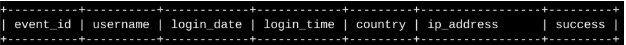

# SQL Practice — Portfolio

This folder contains my SQL learning and practice exercises from Google cybersecurity professionals certificate course, documented with screenshots.  
It demonstrates the AND, OR, and NOT operators in SQL to filter for information.  
All sensitive/personal data has been replaced with placeholders.

## Scenario
I am a security professional at a large organization. Part of my job is to investigate security issues to help keep the system secure. I recently discovered some potential security issues that involve login attempts and employee machines.

My task is to examine the organization’s data in their employees and log_in_attempts tables. Here, I'm using SQL filters to retrieve records from different datasets and investigate the potential security issues.

## Organization database table format

The organization database contains the following two tables:

- <mark>log_in_attempts</mark>
- <mark>employees</mark>

### log_in_attempts
The log_in_attempts table has the following columns:

- <mark>event_id</mark>: The identification number assigned to each login event
- <mark>username</mark>: The username of the employee
- <mark>login_date</mark>: The date the login attempt was recorded
- <mark>login_time</mark>: The time the login attempt was recorded
- <mark>country</mark>: The country where the login attempt occurred
- <mark>ip_address</mark>: The IP address of that employee’s machine
- <mark>success</mark>: The success of the login attempt; FALSE indicates a failed attempt

 
In the MariaDB shell, these columns are returned as:

### employees
The employees table has the following columns:
- <mark>employee_id</mark>: The identification number assigned to each employee
- <mark>device_id</mark>: The identification number assigned to each device used by the employee
- <mark>username</mark>: The username of the employee
- <mark>department</mark>: The department the employee is in
- <mark>office</mark>: The office the employee is located in
  
In the MariaDB shell, these columns are returned as:

## 🗄️ Practice Highlights

### 1. Retrive After Hours login attempts
- **Goal:** My team is investigating failed login attempts that were made after business hours. I want to retrieve this information from the login activity. Office hours end at '18:00'  
- **Why it matters:** All the login attemps are stored in the databse. By filtering the failed login attempts made after <mark>'18:00'</mark> I can identify potential threats like Brute-force attacks, compromised accounts, credential stuffing and misconfigurations. It is a part of my daily SOC monitoring.
- **How this works:** The <mark>login_time</mark> column in the <mark>log_in_attempts</mark> table contains information on when login attempts were made.
The <mark>success</mark> column in the <mark>log_in_attempts</mark> table contains values of <mark>TRUE</mark> or <mark>FALSE</mark> to indicate whether the login was successful. MySQL stores Boolean values as 1 for <mark>TRUE</mark>, and 0 for <mark>FALSE</mark>. This means that <mark>TRUE</mark> is represented as 1, and <mark>FALSE</mark> represented as 0 in the <mark>success</mark> column. In the shell screenshot I can see that 19 failed login attempts were made after '18:00' which means someone is trying to infiltrate the database.

**In MariaDB Shell**  

